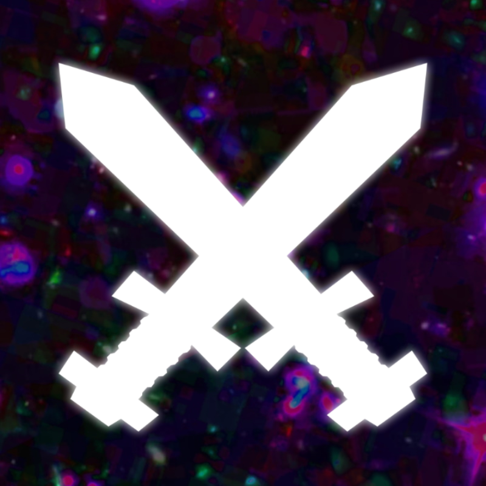

<!-- Improved compatibility of back to top link: See: https://github.com/othneildrew/Best-README-Template/pull/73 -->

[![MIT License][license-shield]][license-url]

<!-- PROJECT LOGO -->
 

  

  <h3 align="center">Fight My Nebbies</h3>

  

    A fun, interactive gacha-like Discord bot inspired by the old website <i>Fight My Monster</i> featuring RPG mechanics, including PvP, monster ("Nebby") customization, minigames and more!
  

<!-- ABOUT THE PROJECT -->
## Features
The bot currently has a variety of commands and features, including:

### Monster Creation
[![Image][showcase-1]](https://github.com/AudricSerador/FightMyNebbies)

### Monster PvP
[![Image][showcase-3]](https://github.com/AudricSerador/FightMyNebbies)
[![Image][showcase-2]](https://github.com/AudricSerador/FightMyNebbies)
[![Image][showcase-4]](https://github.com/AudricSerador/FightMyNebbies)

### Monster Artifacts
[![Image][showcase-5]](https://github.com/AudricSerador/FightMyNebbies)
[![Image][showcase-6]](https://github.com/AudricSerador/FightMyNebbies)

### Goofy Minigames
[![Image][showcase-7]](https://github.com/AudricSerador/FightMyNebbies)
[![Image][showcase-8]](https://github.com/AudricSerador/FightMyNebbies)

...and many more to come.

(<a href="#readme-top">back to top</a>)

## Built With

This bot was built with Python using the Discord.py library, with MySQL as the local database hosted through WampServer and managed through phpMyAdmin.

(<a href="#readme-top">back to top</a>)

<!-- LICENSE -->
## License

Distributed under the MIT License. See `LICENSE.txt` for more information.

(<a href="#readme-top">back to top</a>)

<!-- MARKDOWN LINKS & IMAGES -->
[license-shield]: https://img.shields.io/github/license/othneildrew/Best-README-Template.svg?style=for-the-badge
[license-url]: https://github.com/othneildrew/Best-README-Template/blob/master/LICENSE.txt

[showcase-1]: static/showcase1.png
[showcase-2]: static/showcase2.png
[showcase-3]: static/showcase3.png
[showcase-4]: static/showcase4.png
[showcase-5]: static/showcase5.png
[showcase-6]: static/showcase6.png
[showcase-7]: static/showcase7.png
[showcase-8]: static/showcase8.png